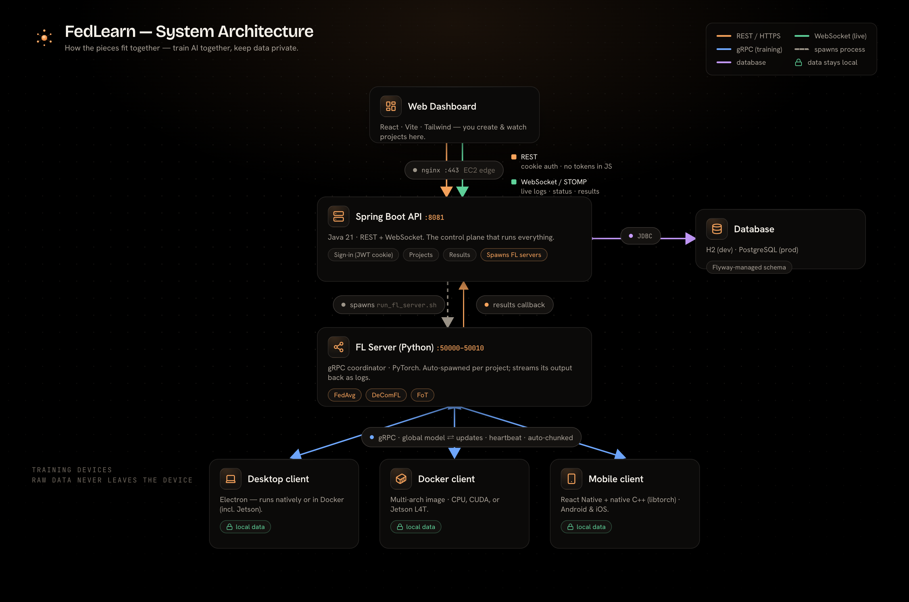
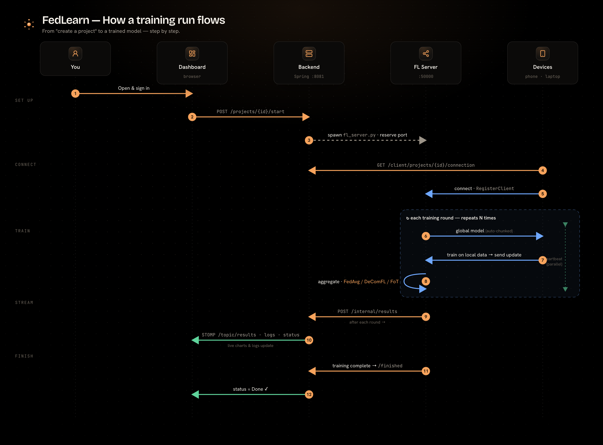

# FedLearn Platform

[](LICENSE)
[](https://www.python.org/)
[](https://reactjs.org/)
[](https://spring.io/projects/spring-boot)
[](https://www.docker.com/)
[](https://aws.amazon.com/)

**A full-stack, federated learning platform with a custom-built framework, web dashboard, and containerized client deployment.**

Built from scratch by the Learning Optimization Group at Rochester Institute of Technology under Professor Haibo Yang.

---

## 🌟 Overview

FedLearn Platform is an **open-source**, end-to-end solution for federated learning that combines:

- **Custom FL Framework** - Built from the ground up (no Flower server/client/strategy semantics; custom protobuf) with advanced features like parameter chunking and parallel heartbeat mechanisms
- **Web Dashboard** - Modern React interface for managing projects, monitoring training, and viewing real-time logs
- **REST API** - Spring Boot backend with JWT authentication and WebSocket streaming
- **Docker Clients** - Pre-packaged containers for zero-installation client deployment
- **Production Deployment** - Running on AWS EC2 with PostgreSQL database

### Key Innovations

🔥 **Parameter Chunking** - Large or transformer models stream over gRPC — the state_dict is serialized to one safetensors blob and split into fixed-size chunks (`FEDLEARN_CHUNK_SIZE_MB`, default 4MB); smaller models take a single unary call

⚡ **Parallel Heartbeat** - Dual gRPC stub architecture prevents server timeout during long training sessions

📉 **DeComFL Integration** - Dimension-free communication: O(1) scalar values per round via zeroth-order optimization

🎚️ **Training Arms** - Pick *what* trains, not just *which model*: `FULL`, `FROZEN_HEAD` (backbone frozen, head federated), and `OVA_LP` (one-vs-all linear probing on a frozen encoder). Each recipe declares the arms it supports, and the picker shows the trade-off **measured on that recipe**

🧪 **In-Process Simulator** - Run thousands of clients in one process against the *production* coordinator and strategies — no gRPC, no port pool, no subprocesses

🚀 **Full-Stack Integration** - Seamless orchestration from React UI → Spring Boot → Python FL Server → Docker Clients

---

## 🏗️ Architecture



**How a training run flows — from "create a project" to a trained model:**



### System Components

Seven deployable units:

| Component              | Technology               | Purpose                                  | Deployment                                          |
| ---------------------- | ------------------------ | ---------------------------------------- | --------------------------------------------------- |
| **Frontend**     | React 19 + Vite 6 + TS   | Web dashboard, real-time telemetry       | Local Vite (`:5173`) or a static bundle served by nginx |
| **Backend API**  | Spring Boot 3 (Java 21)  | REST + STOMP, auth, FL-server lifecycle  | AWS EC2 behind nginx + Let's Encrypt                |
| **Database**     | PostgreSQL 16            | Users, projects, runs, training results  | Every profile (H2 retired); local via Docker Compose, deploy via `SPRING_DATASOURCE_*` |
| **FL Framework** | Python + PyTorch         | Installable FL **library** (`import fedlearn`) — server, clients, strategies, wire | `pip install -e framework/`; also baked into the client image |
| **FL Runtime**   | Python scripts           | The **executable layer** the backend shells out to (`fl_server.py`, `client.py`, `recipes.py`, `init_model.py`, `infer.py`) | Launched via `run_*.sh` wrappers; paths resolved from `application.properties` |
| **FL Clients**   | Docker + Python          | Containerized training clients           | Heterogeneous: Jetson AGX Orin (L4T), Apple Silicon, x86 + CUDA |
| **Desktop**      | Electron + TS + dockerode | Host-side orchestrator for FL clients   | Packaged for macOS / Linux / Windows (CPU + CUDA)   |
| **Mobile**       | React Native 0.80 + native C++ (ExecuTorch) | On-device FL client that runs the DeComFL zeroth-order path natively | **Android**, over a TurboModule bridge. The JS app builds on iOS, but the **iOS native core is not wired yet** (MO-14 — the podspec still vendors libtorch-lite; see [`mobile_client/README.md`](mobile_client/README.md)) |

The backend never runs `framework/` directly — it spawns `fl-runtime/` scripts through the
`FlServerManager` → `FlServerProcessRunner` → `LocalProcessFlServerRunner` seam.

### Data Flow

```
Browser
  → nginx :443 (TLS, Let's Encrypt) — only on EC2; local dev hits :8081 direct
  → Spring Boot REST + STOMP (:8081 — on EC2 reached only through nginx; the port is closed in the security group)
  → PostgreSQL  (project + user state)
  → spawns Python FL server (`fl-runtime/run_fl_server.sh`) as a local child process
  → FL server gRPC on a dynamic port in :50000-50010
  → FL clients (Docker / native) connect over gRPC
       ↘ training stub (long blocking calls)
       ↘ heartbeat stub (parallel thread, keeps connection alive)
  → server stdout streamed back as STOMP messages → live in the React dashboard
  → round results persisted, surfaced as sparklines + telemetry
```

Live demo deployment: **https://fedlearn.duckdns.org** (`ec2demo` Spring profile). See [`deploy/TLS.md`](deploy/TLS.md) and [`scripts/deploy-to-aws.sh`](scripts/deploy-to-aws.sh).

---

## 🚀 Key Features

### 1. Custom Federated Learning Framework

The FL layer is built entirely from scratch — no Flower server/client/strategy semantics, custom
protobuf only. **There is no `flwr` dependency at all**: the one thing it was still used for, the
CIFAR-10 IID shard, is now reproduced natively in `fl-runtime/recipes.py` (`CNN_SHUFFLE_SEED = 42`,
the same default it replaced) and verified **byte-identical per partition**, so results recorded
before the swap remain comparable. Dropping it also lifted the transitive `cryptography<45.0.0` and
`protobuf<5.0.0` caps that were holding the security floors down.

**Aggregation strategies** — registered in
[`server/strategy_factory.py`](framework/src/fedlearn/server/strategy_factory.py) and matched
case-insensitively (`fed_avg` == `FedAvg`):

| Strategy    | What it does                                                                    |
| ----------- | ------------------------------------------------------------------------------- |
| `fedavg`    | Federated Averaging — the num-examples-weighted mean                             |
| `fedprox`   | Adds a proximal term so clients stay near the global model on heterogeneous data |
| `fedopt`    | Server-side adaptive optimization (FedAdam by default)                           |
| `fedlora`   | LoRA-adapter aggregation for LLM fine-tuning, with the optional central-DP path  |
| `decomfl`   | Dimension-free communication — O(1) scalars + seeds per round, zeroth-order      |
| `robust`    | Byzantine-robust: coordinate-wise median / β-trimmed mean, with a breakdown-point guard |

`FedAvg`, `FedProx`, `FedOpt`, `Robust` and `DeComFL` are selectable end-to-end from the dashboard;
`FedLoRA` is chosen automatically for LoRA recipes, and `FoT` runs on its own separate server.

**Other capabilities**:

- **Model-recipe catalog** — seven recipes (`PNEUMONIA_CNN`, `CNN`, `CIFAR_RESNET18`, `MLP`,
  `TRANSFORMER`, `LLM_LORA`, `TINYNET_GOLDEN`) served to the UI from `GET /api/model-recipes`.
  A recipe bundles architecture + dataset loader + transform + labels + input kind under one key.
- **Training arms** — a recipe declares its `supported_arms`, and an arm carries an **objective**,
  not just a trainable-parameter subset (`OVA_LP` trains one-vs-all heads, the rest cross-entropy).
- **In-process simulation** — thousands of clients in one process, driving the production
  coordinator and strategies by direct method call; determinism derives from `(seed, client_id, round)`.
- **Non-IID partitioning** — Dirichlet, pathological, shard and IID splitters
  ([`simulation/partition.py`](framework/src/fedlearn/simulation/partition.py)).
- **Central differential privacy** with a from-scratch RDP accountant (no Opacus dependency).
- **Support for CNNs, Transformers, and LLMs** (LoRA fine-tuning of Qwen2.5-0.5B / TinyLlama-1.1B).

**See**: [`framework/README.md`](framework/README.md) · [`fl-runtime/README.md`](fl-runtime/README.md)

---

### 2. Parameter Chunking for Large Models

**Challenge**: A single gRPC message has a hard size ceiling, so large models (LLMs) cannot be sent in one shot.

**Solution**: The upload path picks streaming vs. unary at the call site. Any transformer model, or any model over **100MB**, is streamed: the `state_dict` is serialized to one deterministic safetensors blob, then split into fixed-size chunks (`FEDLEARN_CHUNK_SIZE_MB`, default **4MB**). Everything else takes a single unary call.

```python
# framework/src/fedlearn/client/grpc_client.py — size-gated streaming
STREAMING_THRESHOLD_MB = 100
ALWAYS_STREAM_TRANSFORMERS = True

if (is_transformer and ALWAYS_STREAM_TRANSFORMERS) or size_mb > STREAMING_THRESHOLD_MB:
    return self._submit_update_stream(params, num_examples, round_number)
return self._submit_update_unary(params, num_examples, round_number)

# framework/src/fedlearn/communication/serializer.py — chunk size within the streaming path
_DEFAULT_CHUNK_SIZE_MB = int(os.environ.get("FEDLEARN_CHUNK_SIZE_MB", "4"))
CHUNK_SIZE = _DEFAULT_CHUNK_SIZE_MB * 1024 * 1024
```

**The wire itself is safetensors, never pickle** — byte-deterministic, so the same model produces
the same bytes on every platform, and decodable by the mobile client's libtorch-free C++ core. That
requires **float32**, so non-float32 buffers (a BatchNorm module's int64 `num_batches_tracked`, for
example) are withheld from the federated set and kept local rather than crashing the round —
which is what lets ResNet-style models federate on the `FULL` arm. Withheld tensors are counted and
logged, never dropped silently. Float32 `running_mean`/`running_var` *are* still federated.

**Benefits**:

- Supports the catalog's transformer/LLM recipes — `TRANSFORMER` (OPT-125M) and `LLM_LORA` (Qwen2.5-0.5B / TinyLlama-1.1B). The base-model list per recipe is closed: `recipes.py` rejects an unknown base rather than downloading it
- Memory-efficient transmission
- Transparent to end users

---

### 3. Parallel Heartbeat Mechanism

**Challenge**: During local training, clients cannot respond to server pings → connection timeout.

**Solution**: Dual gRPC stub architecture.

```
Client has TWO gRPC stubs:

Stub 1 (Training):          Stub 2 (Heartbeat):
- Send/receive parameters   - Send periodic pings
- Blocked during training   - Always responsive
- Heavy operations          - Lightweight
```

The heartbeat is **bidirectional** (FR-10), not just a keep-alive: the server can answer a
heartbeat with `should_stop=True`, which latches a `threading.Event` on the client. The fit loop
polls it between local steps and aborts the round — so a stop issued from the dashboard reaches a
client that is deep inside a blocking `fit()`.

```python
# framework/src/fedlearn/client/grpc_client.py — the heartbeat thread
res = self.heartbeat_stub.Heartbeat(req, timeout=30.0)
if res.should_stop:
    self._stop_training.set()      # polled by the fit loop via should_stop_training()
```

**Benefits**:

- Prevents false timeouts
- Supports long training sessions (hours)
- Gives the server a way to cancel a round already in flight

---

### 4. Real-Time WebSocket Log Streaming

Live server logs displayed in React dashboard via STOMP/WebSocket.

```javascript
// Frontend subscribes to logs
client.subscribe(`/topic/logs/${projectId}`, (message) => {
    console.log(message.body);  // Real-time log line
});
```

**Backend streams Python process output**:

```java
// Spring Boot captures Python stdout
BufferedReader reader = new BufferedReader(
    new InputStreamReader(process.getInputStream())
);
String line;
while ((line = reader.readLine()) != null) {
    webSocketService.sendLogs(projectId, line);  // Broadcast via WebSocket
}
```

---

### 5. Docker-Based Client Deployment

Pre-packaged Docker images with framework + dependencies.

**The container is configured by environment variables, not CLI flags.** `entrypoint.sh` exits `1`
if `PROJECT_ID`, `SERVER_ADDRESS` or `PARTITION_ID` is missing, then builds the
`--project-id` / `--server-address` / `--partition-id` flags itself and forwards anything else
you pass through to `client.py`.

```bash
# Build — the build context is the REPO ROOT, because the Dockerfile
# COPYs both framework/ and fl-runtime/. Run this from the repo root:
docker build -f client-docker/Dockerfile -t fedlearn-client:latest .

# Run
docker run --rm -it -v /path/to/data:/data \
  -e PROJECT_ID=<uuid> \
  -e SERVER_ADDRESS=<host>:<port> \
  -e PARTITION_ID=0 \
  -e FEDLEARN_CONNECTION_TOKEN=<token> \
  fedlearn-client:latest
```

`MODEL_TYPE`, `STRATEGY` and `TRAINING_ARM` are optional env vars the desktop launcher sets for you;
extra flags (`--use-llm`, `--dataset cb|sst2`) are forwarded as-is. The connection token comes from
`GET /api/client/projects/{id}/connection` and is required when the server has client auth on (SE-14).

For a Jetson image, override the base:

```bash
docker build -f client-docker/Dockerfile \
  --build-arg BASE_IMAGE=nvcr.io/nvidia/l4t-pytorch:r35.2.1-pth2.0-py3 \
  -t fedlearn-client:jetson .
```

**Benefits**:

- No Python/PyTorch installation required
- Consistent environment across clients
- Easy distribution to non-technical users

**See**: [`client-docker/README.md`](client-docker/README.md)

---

### 6. Stateless JWT via HttpOnly Cookies

Spring Security signs a stateless JWT and delivers it to the browser as an **HttpOnly, Secure, SameSite-tightened cookie**. The frontend never sees the token in JavaScript — `withCredentials: true` on Axios is the only thing it does to authenticate.

**Flow**:

```
1. User logs in   → Spring Boot validates credentials, signs a JWT
2. Backend sets jwtToken as an HttpOnly cookie in the response
3. Browser auto-sends the cookie on every subsequent request
4. JwtAuthenticationFilter reads the cookie, validates, sets SecurityContext
5. Resource-level checks ensure users only see their own projects
```

This deliberately closes the XSS exfiltration vector: there is no `localStorage` or JS-readable token to steal. The same model applies to the Electron desktop app — auth state lives in the main-process session, never crosses into the renderer.

---

## 📊 Technology Stack

### Frontend

- **React 19** - Modern UI library
- **Vite 6** - Fast build tool
- **React Router v7** - Client-side routing
- **Axios** - HTTP client
- **STOMP.js** - WebSocket client
- **React Icons** - Icon library
- **Tailwind v4** - Styling, driven by the generated Ledger design tokens
- **Deployment**: `npm run build` produces a static bundle served by **nginx on the EC2 host** (there is no hosted-platform pipeline; `frontend/vercel.json` is a vestigial SPA-rewrite file, unused by any build or deploy path here)

### Backend

- **Spring Boot 3** + **Java 21** + **Gradle**
- **Spring Security** + **JWT** delivered as HttpOnly cookies
- **WebSocket (STOMP)** for live log + telemetry streaming
- **JPA / Hibernate** (validate-only) — schema owned by **Flyway**
- **PostgreSQL 16** for every profile (H2 retired) — local via Docker Compose, tests via Testcontainers, deploy via `SPRING_DATASOURCE_*`
- **Deployment**: AWS EC2 (Ubuntu) behind **nginx** + **Let's Encrypt**

### FL Framework

- **Python** — `setup.py` declares a **3.10+** floor; **3.12** is what CI actually tests
- **PyTorch** — pinned to **`torch==2.12.0`** in `framework/requirements.txt`, not a loose `2.0+` range. The pin is load-bearing: the DeComFL golden fixtures and the `executorch==1.3.1` native extension were built against it, and `test_torch_version_matches_manifest` fails the suite if it drifts. `torchvision`/`torchaudio` are deliberately **not** listed (ABI mismatch against this torch build) — install them from the matched index only where a consumer needs them
- **gRPC** + **Protocol Buffers** (`protobuf>=5.29.0,<6.0.0`) — two buf-governed contracts, `fedlearn.v2` and `fedlearn.fot.v1`
- **safetensors** — the deterministic, float32-only model wire (no pickle)
- **NumPy** - Numerical computing
- **Transformers** + **PEFT** - HuggingFace libraries (for LLM / LoRA recipes)

### DevOps

- **Docker** - Containerization
- **Docker Compose** - Multi-container orchestration
- **AWS EC2** - Cloud hosting
- **GitHub Actions** - CI/CD gates (`.github/workflows/`: `ci.yml`, `mobile.yml`, `security.yml`, `proto.yml`, `release-desktop.yml`, `release-mobile.yml`)
- **Nginx** - Reverse proxy (optional)

---

## 📁 Repository Structure

```
FedLearn-Platform/
├── framework/                  # The FL LIBRARY (pip install -e . → import fedlearn)
│   ├── src/fedlearn/
│   │   ├── client/            # FL client, gRPC client, DeComFL client, local trainer
│   │   ├── server/            # Coordinator, strategies, strategy_factory, robust_aggregation
│   │   ├── communication/     # gRPC stubs, safetensors codec + serializer, proto mirrors
│   │   ├── simulation/        # In-process federation, partitioners, seeded RNG
│   │   ├── security/          # gRPC TLS + connection-token auth + interceptors
│   │   ├── privacy/           # Central DP: RDP accountant + Gaussian mechanism
│   │   ├── estimators/        # DeComFL zeroth-order estimators
│   │   ├── backbone/          # Backbone distribution for the frozen arms
│   │   ├── bundle/            # Adapter-bundle manifest + schema (BUNDLE_FORMAT.md)
│   │   └── fot/               # Federation over Text (additive, torch-free)
│   ├── examples/              # simple_federation, llm_federation, ecg_federation,
│   │                          #   ecg_decomfl_*, fot_text_federation
│   ├── setup.py · requirements.txt · CONTRIBUTING.md
│   └── README.md
│
├── fl-runtime/                 # The EXECUTABLE layer the backend shells out to
│   ├── fl_server.py            # Gradient FL server      (run_fl_server.sh / .bat)
│   ├── fl_fot_server.py        # FoT server              (run_fot_server.sh)
│   ├── client.py               # Canonical FL client — docker + desktop + local (DA-5)
│   ├── recipes.py              # Recipe catalog + training arms (run_recipes.sh --describe)
│   ├── init_model.py · infer.py · data.py · models.py · config.py · device.py
│   ├── arm_tradeoff.json       # Per-recipe MEASURED arm trade-off shown in the picker
│   ├── benchmarks.py · pytest.ini · tests/    # This unit has its OWN pytest suite
│   └── README.md
│
├── frontend/                   # React 19 + Vite 6 + TS dashboard
│   ├── src/{components,pages,services,context}/
│   ├── .env.{development,ec2demo,production}   # Mirror the Spring profiles 1:1
│   └── README.md
│
├── backend/                    # Spring Boot API
│   └── fl-platform-api/
│       ├── src/main/java/com/federated/fl_platform_api/
│       │   ├── config/        # Security, WebSocket, FlOrchestrationModeValidator
│       │   ├── controller/ service/ repository/ model/ security/ dto/
│       │   └── orchestration/ # FlServerManager + FlServerProcessRunner (DA-12 / DA-8)
│       ├── src/main/resources/db/migration/    # Flyway V1 … V23 — schema owner
│       ├── requirements.txt   # Python deps for the spawned FL servers
│       └── README.md
│
├── fedlearn-desktop/           # Electron host-side orchestrator (TS + dockerode)
│   ├── src/                   # main / preload / renderer
│   └── README.md
│
├── mobile_client/              # React Native 0.80 + native C++ (ExecuTorch) core
│   ├── bridge/ shared/ android/ ios/           # TurboModule bridge + native core
│   ├── proto/                 # Byte-mirror of proto/ (CI-enforced)
│   └── README.md
│
├── client-docker/              # Docker client image (thin wrapper around fl-runtime/client.py)
│   ├── Dockerfile             # NOTE: build context is the REPO ROOT
│   ├── entrypoint.sh          # Env-var contract; hard-fails on missing PROJECT_ID etc.
│   ├── packaging/             # Native PyInstaller bundle builds (mac / win / linux)
│   └── README.md · DEPLOYMENT_GUIDE.md
│
├── proto/                      # CANONICAL gRPC contracts (buf-governed) + generated stubs
│   ├── fedlearn/v2/fedlearn.proto      # package fedlearn.v2  — the gradient path
│   ├── fedlearn/fot/v1/fot.proto       # package fedlearn.fot.v1 — the FoT path
│   ├── gen/{python,java,cpp,ts}/       # Generated code (regenerate-is-a-no-op in CI)
│   └── buf.yaml · buf.gen.yaml · README.md
│
├── design/                     # Ledger design system: tokens.json + build-tokens.mjs + brand/
├── deploy/                     # nginx reverse-proxy config + TLS.md runbook
├── scripts/                    # deploy-to-aws, check_proto_mirror, check_no_skipped_tests,
│                               #   export_model, stage_model_bundle, build_arm_tradeoff, …
├── wikis/                      # Committed technical docs (the master wiki)
│   ├── README.md              # Start here — current build status per unit
│   ├── VERSIONS.md            # Per-unit release versions (single source of truth)
│   ├── assets/                # Architecture + flow diagrams
│   ├── backend/ frontend/ framework/ fl-runtime/ desktop/ mobile/ client-docker/   # Per-unit deep docs
│   └── html/                  # Rendered wiki pages
│
├── .github/workflows/          # ci.yml · mobile.yml · proto.yml · security.yml
│                               #   release-desktop.yml · release-mobile.yml
├── launch_all.sh               # macOS one-shot launcher (backend + frontend + desktop + clients)
├── README.md                   # This file
└── LICENSE                     # Apache 2.0

# Local working areas, gitignored — present on a developer's machine, NOT in a clone:
#   docs/       long-form design notes, guides, audits, generated report pages
#   research/   paper working area: benchmark harnesses, raw result JSON, experiment notes
```

---

## 🚀 Quick Start

### Prerequisites

- **Java 21**
- **Node.js 24** (pinned by `.nvmrc` / `.tool-versions`; CI builds on 24)
- **Python 3.10+** (only if you run the FL framework directly; CI runs 3.12 — the Docker client bundles its own runtime)
- **Docker** (for FL clients, for local PostgreSQL, and for the Testcontainers-backed `test` profile)

PostgreSQL 16 is required locally — `cd backend/fl-platform-api && docker compose up -d` starts one at `localhost:5432/federance`.

### Run the full stack

```bash
./launch_all.sh
```

This opens four terminal windows: backend on `:8081` (Spring profile `dev`), Vite on `:5173`, Electron on `:9000`, and the FL-client launcher.

### Run components individually

Each block below starts from the **repo root** — open a fresh shell per component.

```bash
# Backend
cd backend/fl-platform-api
SPRING_PROFILES_ACTIVE=dev ./gradlew bootRun

# Frontend — three modes, all mirror Spring profiles 1:1
cd frontend && npm install
npm run dev               # full-local: backend on localhost:8081
npm run dev:ec2demo       # frontend-local, backend on https://fedlearn.duckdns.org via Vite proxy
npm run build             # production bundle

# FL framework (Python) — torch is intentionally NOT installed by setup.py;
# install the pinned build (2.12.0) from the PyTorch index first if you need it.
cd framework
pip install -e .
PYTHONPATH=src python -m pytest -q          # how CI runs the suite

# FL runtime — the scripts the backend actually executes; it has its own suite
cd fl-runtime && python -m pytest -q
bash run_recipes.sh --describe              # the recipe catalog the dashboard renders

# Docker FL client — build from the REPO ROOT, configure by env var
docker build -f client-docker/Dockerfile -t fedlearn-client:latest .
docker run --rm -it -v /path/to/data:/data \
  -e PROJECT_ID=<uuid> -e SERVER_ADDRESS=localhost:50051 -e PARTITION_ID=0 \
  fedlearn-client:latest
```

For deployed environments, see **[`deploy/TLS.md`](deploy/TLS.md)** (nginx + Let's Encrypt), **[`scripts/deploy-to-aws.sh`](scripts/deploy-to-aws.sh)** (the EC2 deploy script) and **[`client-docker/DEPLOYMENT_GUIDE.md`](client-docker/DEPLOYMENT_GUIDE.md)** (Jetson and native clients).

---

## 📖 Documentation

Comprehensive documentation for each component:

| Component               | Documentation                                                           |
| ----------------------- | ----------------------------------------------------------------------- |
| **FL Framework**  | [`framework/README.md`](framework/README.md)                             |
| **FL Runtime**    | [`fl-runtime/README.md`](fl-runtime/README.md)                           |
| **Frontend**      | [`frontend/README.md`](frontend/README.md)                               |
| **Backend API**   | [`backend/fl-platform-api/README.md`](backend/fl-platform-api/README.md) |
| **Docker Client** | [`client-docker/README.md`](client-docker/README.md)                     |
| **Desktop**       | [`fedlearn-desktop/README.md`](fedlearn-desktop/README.md)               |
| **Mobile Client** | [`mobile_client/README.md`](mobile_client/README.md)                     |
| **gRPC contracts**| [`proto/README.md`](proto/README.md)                                     |

**Cross-cutting docs:**

- **Deep-dive wikis** (per-unit architecture + each unit's current build status): [`wikis/`](wikis/) — start at [`wikis/README.md`](wikis/README.md)
- **Design system — "Ledger"** (navy structural ink on quiet paper surfaces, light-first): [`wikis/frontend/UI_and_Components.md`](wikis/frontend/UI_and_Components.md) · canonical tokens: [`design/tokens.json`](design/tokens.json), which `design/build-tokens.mjs` compiles into the per-platform outputs for web, desktop and mobile
- **Per-unit release versions**: [`wikis/VERSIONS.md`](wikis/VERSIONS.md)

### Operational Guides

- **TLS / nginx reverse proxy**: [`deploy/TLS.md`](deploy/TLS.md) · [`deploy/nginx/fedlearn.conf`](deploy/nginx/fedlearn.conf)
- **Framework contribution guide**: [`framework/CONTRIBUTING.md`](framework/CONTRIBUTING.md)

---

## 🔬 Research & Publications

This platform is grounded in published research, at two very different levels of maturity — and the
difference matters, so it is stated plainly.

**Achieving Dimension-Free Communication in Federated Learning via Zeroth-Order Optimization** (ICLR 2025) — ✅ **implemented and running**

- Authors: Zhe Li, Bicheng Ying, Zidong Liu, Chaosheng Dong, Haibo Yang (Rochester Institute of Technology)
- Paper: [arXiv:2405.15861](https://arxiv.org/abs/2405.15861) · Reference implementation: [ZidongLiu/DeComFL](https://github.com/ZidongLiu/DeComFL) (Apache-2.0)
- Implementation: [`server/decomfl_strategy.py`](framework/src/fedlearn/server/decomfl_strategy.py), [`client/decomfl_client.py`](framework/src/fedlearn/client/decomfl_client.py), [`estimators/`](framework/src/fedlearn/estimators/) — Algorithms 2–4 are mapped line-by-line in [`wikis/framework/06_decomfl.md`](wikis/framework/06_decomfl.md). It runs end-to-end on the platform, and the mobile client's C++ core reproduces the Python golden perturbation vectors and the pinned multi-round trajectory bit-for-bit in CI. **Not yet done:** the hands-on device-in-the-loop acceptance run — a physical phone completing a round against a live server ([`mobile_client/ON_DEVICE_TRAINING_E2E.md`](mobile_client/ON_DEVICE_TRAINING_E2E.md)).

**Federation over Text (FoT)** — 🚧 **scaffolding complete, the method has not been run**

- Reference: [arXiv:2604.16778](https://arxiv.org/abs/2604.16778) · Code: [`framework/src/fedlearn/fot/`](framework/src/fedlearn/fot/)
- An additive, torch-free research mode orthogonal to the gradient path, with its own `fedlearn.fot.v1` contract and its own server — the *vertical slice* is genuinely wired from the UI down. **But no LLM has ever run through it**: `get_backend()` only returns a deterministic stub, and the `local-http` / `vllm` / `ollama` backends raise "not implemented in this build". There is no FoT result in the record, so please don't read it as a validated reproduction. Wiring a real local backend is the documented next step.

**Byzantine-robust aggregation** follows Yin et al., [*Byzantine-Robust Distributed Learning*](https://arxiv.org/abs/1803.01498) (2018); the **RDP accountant** re-implements Mironov et al., [*Rényi DP of the Sampled Gaussian Mechanism*](https://arxiv.org/abs/1908.10530) (2019); the **OvA-LP** training arm follows [arXiv:2511.05028](https://arxiv.org/abs/2511.05028) (frozen encoder + one-vs-all heads — note the paper's two-stage schedule is *not* implemented).

### Citation

If you use FedLearn Platform in your research, please cite the DeComFL paper:

```bibtex
@inproceedings{li2025decomfl,
  title={Achieving Dimension-Free Communication in Federated Learning via Zeroth-Order Optimization},
  author={Li, Zhe and Ying, Bicheng and Liu, Zidong and Dong, Chaosheng and Yang, Haibo},
  booktitle={International Conference on Learning Representations (ICLR)},
  year={2025}
}
```

---

## 🎯 Use Cases

### 1. Healthcare

- Train medical diagnosis models across hospitals
- Preserve patient privacy
- Aggregate knowledge without sharing sensitive data

### 2. Finance

- Fraud detection across banks
- Credit risk modeling
- Regulatory compliance (GDPR, HIPAA)

### 3. IoT & Edge Computing

- Distributed sensor networks
- Mobile device training (smartphones)
- Low-bandwidth environments

### 4. Research

- Academic federated learning experiments
- Algorithm benchmarking
- Privacy-preserving ML research

---

## 🛡️ Security & Privacy

### Data Privacy

- ✅ Raw data never leaves client devices
- ✅ Only model updates (FedAvg) or O(1) gradient scalars + seeds (DeComFL) are transmitted
- ✅ **Central differential privacy** on FedLoRA aggregation — per-client L2 clipping plus calibrated Gaussian noise, accounted by a **from-scratch Rényi-DP accountant** for the Sampled Gaussian Mechanism ([`framework/src/fedlearn/privacy/`](framework/src/fedlearn/privacy/)). No Opacus or TF-Privacy dependency: the per-order RDP matches Opacus to ~1e-9, and the ε→δ conversion deliberately uses the classic Mironov bound, so the ε reported here is *conservative* rather than optimistic. Drive it from a target budget (`--dp-target-epsilon --dp-delta --dp-rounds`) and the accountant solves for the noise multiplier.

### Robustness

- ✅ **Byzantine-robust aggregation** ([`server/robust_aggregation.py`](framework/src/fedlearn/server/robust_aggregation.py)) — a drop-in strategy replacing the weighted mean with a coordinate-wise **median** or **β-trimmed mean** (Yin et al. 2018), plus NaN/Inf rejection, server-side L2 update clipping, and a **breakdown-point guard** that refuses to aggregate rather than silently produce a poisoned model when the estimated malicious fraction exceeds what the estimator can tolerate. Aggregation is deliberately *unweighted* by `num_examples` — an attacker controls its own reported count.
- ⚠️ Both estimators are large-cohort defenses and degrade at the 1–3 client cohorts this platform often runs, which is why `Robust` is opt-in per project rather than the default.

### Authentication

- ✅ Stateless JWT delivered as **HttpOnly + Secure** cookies (no JS-readable token storage)
- ✅ Resource-level authorization (users only see their own projects)
- ✅ STOMP WebSocket auth via the same cookie

### Network Security

- ✅ TLS terminated at nginx (Let's Encrypt) on the EC2 deployment
- ⚠️ Backend `:8081` is **not** loopback-bound — `server.address=0.0.0.0` in the base and `production` property files, and the systemd unit sets no override. nginx proxies to `127.0.0.1:8081`, but keeping `:8081` off the public internet is a **security-group rule the operator must set**, not something the process enforces ([`deploy/TLS.md`](deploy/TLS.md))
- ✅ Strict CORS allowlist — Spring fails fast on missing config
- ⚠️ gRPC FL client traffic is **plaintext by default**. TLS is implemented and opt-in: set `FEDLEARN_GRPC_USE_TLS=1` plus `FEDLEARN_GRPC_SERVER_CERT`/`_KEY` (and `FEDLEARN_GRPC_REQUIRE_CLIENT_AUTH=1` for mTLS). On deployed profiles the backend sets `FEDLEARN_REQUIRE_TLS=1`, which makes the FL server **fail closed** rather than serve in the clear (SE-2).
- ✅ Per-client connection tokens (`FEDLEARN_CONNECTION_TOKEN`, SE-14) issued via `GET /api/client/projects/{id}/connection`

---

## 🚀 Deployment

### Local development

`./launch_all.sh` launches everything in parallel terminal windows. Or run individually:

```bash
# Backend (Gradle, Java 21)
cd backend/fl-platform-api && SPRING_PROFILES_ACTIVE=dev ./gradlew bootRun

# Frontend
cd frontend && npm run dev

# FL example
cd framework/examples/simple_federation
python run_server.py
python run_client.py --id 0
```

### EC2 demo (`ec2demo` profile)

Live at **https://fedlearn.duckdns.org**. The deployed shape:

- AWS EC2 (Ubuntu 24.04 LTS, `r5.large`)
- nginx terminates TLS on `:443`, proxies to Spring Boot on `127.0.0.1:8081`
- Let's Encrypt certbot for auto-renewing TLS
- PostgreSQL 16 (local Docker Compose or host package) on the EC2 host, data dir EBS-backed across reboots
- Spring Boot as a systemd service (`fedlearn.service`)
- Python FL servers spawned by `FlServerManager`

Required env vars. `scripts/ec2-bootstrap.sh` generates both files — the **two secrets go in the
root-only (`0600`) `EnvironmentFile`**, never inline in the unit; only the non-secret settings are
`Environment=` lines in `/etc/systemd/system/fedlearn.service`:

```bash
# EnvironmentFile (0600 root:root) — secrets
APP_JWT_SECRET=<openssl rand -base64 64>
APP_INTERNAL_API_KEY=<openssl rand -hex 32>

# fedlearn.service — non-secret
CORS_ALLOWED_ORIGINS=https://fedlearn.duckdns.org,http://localhost:5173
APP_AUTH_COOKIE_SECURE=true
```

### Hardened single-VM (`production` profile)

Same shape as the EC2 demo above, with production hardening — **FL servers run as local processes**. This is the only supported deployed architecture.

**ECS/Fargate orchestration is not implemented** (OP-14). Setting `ecs.cluster-name` (`ECS_CLUSTER_NAME`) now **fails the boot** with a clear error, in every profile, via `FlOrchestrationModeValidator` — deliberately, so an operator finds out at startup rather than on their first federation. Leave it unset to use the supported local-process path. Managed-task orchestration — S3 model storage, FL servers as ECS tasks, multi-replica safety — is deferred to **OP-12**.

---

## 🤝 Contributing

We welcome contributions! This is an open-source project under Apache 2.0 license.

### How to Contribute

1. **Fork** the repository
2. **Create** a feature branch (`git checkout -b feature/amazing-feature`)
3. **Commit** your changes (`git commit -m 'Add amazing feature'`)
4. **Push** to the branch (`git push origin feature/amazing-feature`)
5. **Open** a Pull Request

### Development Setup

See individual component documentation:

- Framework: [`framework/CONTRIBUTING.md`](framework/CONTRIBUTING.md)
- FL runtime: [`fl-runtime/README.md`](fl-runtime/README.md)
- Backend: [`backend/fl-platform-api/DEVELOPMENT.md`](backend/fl-platform-api/DEVELOPMENT.md)
- Frontend: [`frontend/README.md`](frontend/README.md) and `frontend/.env.example`

### What CI will check

Gates are enforced in `.github/workflows/`, not by a pre-commit hook, and jobs are **path-filtered**
so only the units you touched run. A few are stricter than a bare test run — worth knowing before
you open a PR:

- `framework/` — `PYTHONPATH=src python -m pytest -q`, with **coverage enforced** (`--cov=fedlearn`), so a coverage drop can fail the job.
- `fl-runtime/` — its own pytest suite with `FEDLEARN_FAIL_ON_UNEXPECTED_SKIP=1`: a **skipped** test fails the job.
- Backend — `./gradlew test jacocoTestCoverageVerification` against a **Testcontainers PostgreSQL**, so a live Docker daemon is required. There is a 0.70 bundle line-coverage floor.
- `frontend/` / `mobile_client/` — ESLint + `tsc --noEmit` + tests. Desktop runs ESLint + Jest, plus a guard that fails on skipped or focused suites.
- Protos — **never hand-edit a mirror.** Edit `proto/` and copy; `proto.yml` runs buf lint, a **breaking-change gate against `main`**, a regenerate-is-a-no-op check, and `scripts/check_proto_mirror.sh`, which prints the exact `cp` to fix any drift.
- Adding a model type is mostly a `recipes.py` entry — *model construction* is fully registry-dispatched (`init_model.py` and `infer.py` build every type through `recipes.get_recipe(key).build_model(...)`, no per-type branch). **Client-side data loading is not yet**: `client.py`'s `load_data` still selects the shard by explicit branch and falls through to the CIFAR-10 loader, so a new recipe without its own branch trains on the wrong data *silently* rather than failing. Add the branch.
- Adding an entity field takes a new Flyway migration (`V24__*.sql` and up). JPA runs `validate`-only everywhere except the `test` profile; there is no `ddl-auto=update` to fall back on.

### Code of Conduct

- Be respectful and inclusive
- Provide constructive feedback
- Focus on collaboration
- Help newcomers

---

## 📝 License

This project is licensed under the **Apache License 2.0** - see the [LICENSE](LICENSE) file for details.

```
Copyright 2024 Learning Optimization Group, Rochester Institute of Technology

Licensed under the Apache License, Version 2.0 (the "License");
you may not use this file except in compliance with the License.
You may obtain a copy of the License at

    http://www.apache.org/licenses/LICENSE-2.0

Unless required by applicable law or agreed to in writing, software
distributed under the License is distributed on an "AS IS" BASIS,
WITHOUT WARRANTIES OR CONDITIONS OF ANY KIND, either express or implied.
See the License for the specific language governing permissions and
limitations under the License.
```

---

## 👥 Team

**Principal Investigator**: Professor Haibo Yang
**Institution**: Rochester Institute of Technology
**Research Group**: Learning Optimization Group

**Developer**: Anurag Lnu (MS Computer Science, RIT)

---

## 🙏 Acknowledgments

- Rochester Institute of Technology for research support
- Learning Optimization Group for collaboration
- Open-source community for inspiration

---

## 📧 Contact & Support

- **Issues**: [GitHub Issues](https://github.com/Learning-Optimization-Group/FedLearn-Platform/issues)
- **Discussions**: [GitHub Discussions](https://github.com/Learning-Optimization-Group/FedLearn-Platform/discussions)
- **Email**: haibo.yang@rit.edu (Professor Haibo Yang)

---

## 🌟 Star History

If you find this project useful, please consider giving it a ⭐️ on GitHub!

---

**Built with ❤️ by the Learning Optimization Group at Rochester Institute of Technology**

**Open Source • Production Ready • Research Grade**
